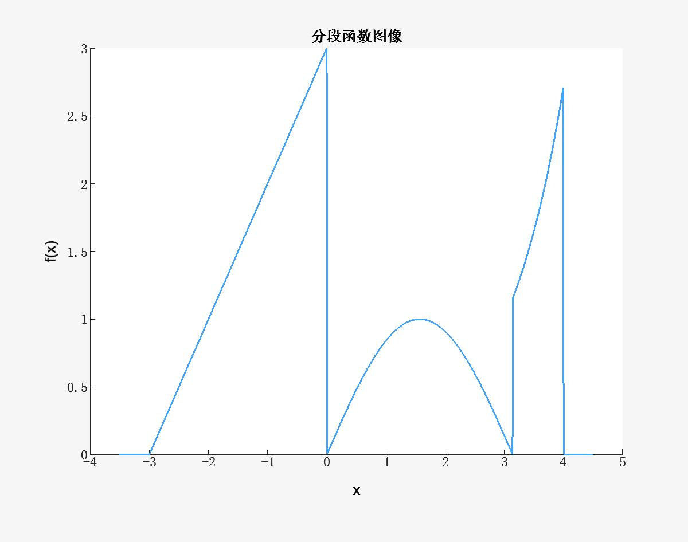

# 数值方法 Homework3

## Problem 1

使用`while`循环判断乘2上溢的次数
```matlab
large_value = realmax('double');
count = 0;
while large_value < inf
    large_value = large_value * 2;
    count = count + 1;
end;
```
得到结果，只需经过一次乘以2就会上溢，与`large_value`是`double`能表示的最大值的性质相符

## Problem 2

(1)~(3)

计算和的代码如下
```matlab
n = 10000;

% (1) 单精度正序求和
sum1 = single(0);
for i = 1:n
    sum1 = sum1 + single(1 / i^2);
end
fprintf('(1) 单精度正序求和结果为%.6f\n', sum1);

% (2) 单精度逆序求和
sum2 = single(0);
for i = n:-1:1
    sum2 = sum2 + single(1 / i^2);
end
fprintf('(2) 单精度逆序求和结果为%.6f\n', sum2);
```

```matlab
% (3) 双精度正序求和
sum3 = double(0);
for i = 1:n
    sum3 = sum3 + double(1 / i^2);
end
fprintf('(3) 双精度正序求和结果为%.6f\n', sum3);

% (3) 双精度逆序求和
sum4 = double(0);
for i = n:-1:1
    sum4 = sum4 + double(1 / i^2);
end
fprintf(['(3) 双精度逆序求和结果为%.6f\n\n'], sum4);
```

得到的结果为
```
(1) 单精度正序求和结果为1.644725
(2) 单精度逆序求和结果为1.644834
(3) 双精度正序求和结果为1.644834
(3) 双精度逆序求和结果为1.644834
```

(4) 问题：虽然在数学上计算顺序对结果没有影响，但实际上单精度正序求和的结果小于其他求和方式所得的结果

原因：两种不同的计算公式在数学上是等价的，但是在计算上并不等价，在精度不足时，进行大数+小数的运算会导致小数被忽略，因此单精度正序求和在$n$较大时，后面的许多项事实上并未参与求和而是在计算时被略去，导致结果相对较小。

单精度逆序求和先将小数相加到相对更大的值，再与前面较大的项做加法时并不会被略去；而双精度求和时由于精度仍足够，所以正序逆序的结果没有误差。

## Problem 3

使用以下代码生成图像
```matlab
x = linspace(-3.5, 4.5, 1000);
y = zeros(size(x));

for i = 1:length(x)
    if -3 <= x(i) && x(i) < 0
        y(i) = x(i) + 3;
    elseif 0 <= x(i) && x(i) < pi
        y(i) = sin(x(i));
    elseif pi <= x(i) && x(i) <= 4
        y(i) = exp(x(i) - 3);
    end
end

plot(x, y, 'LineWidth', 2);
xlabel('x');
ylabel('f(x)');
title('分段函数图像');
```

得到的函数图像如下所示

