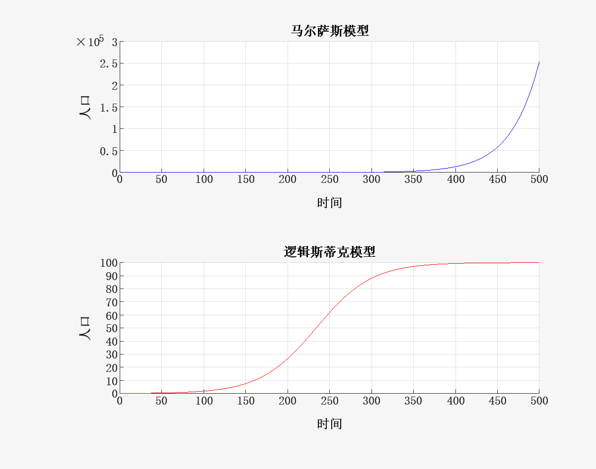
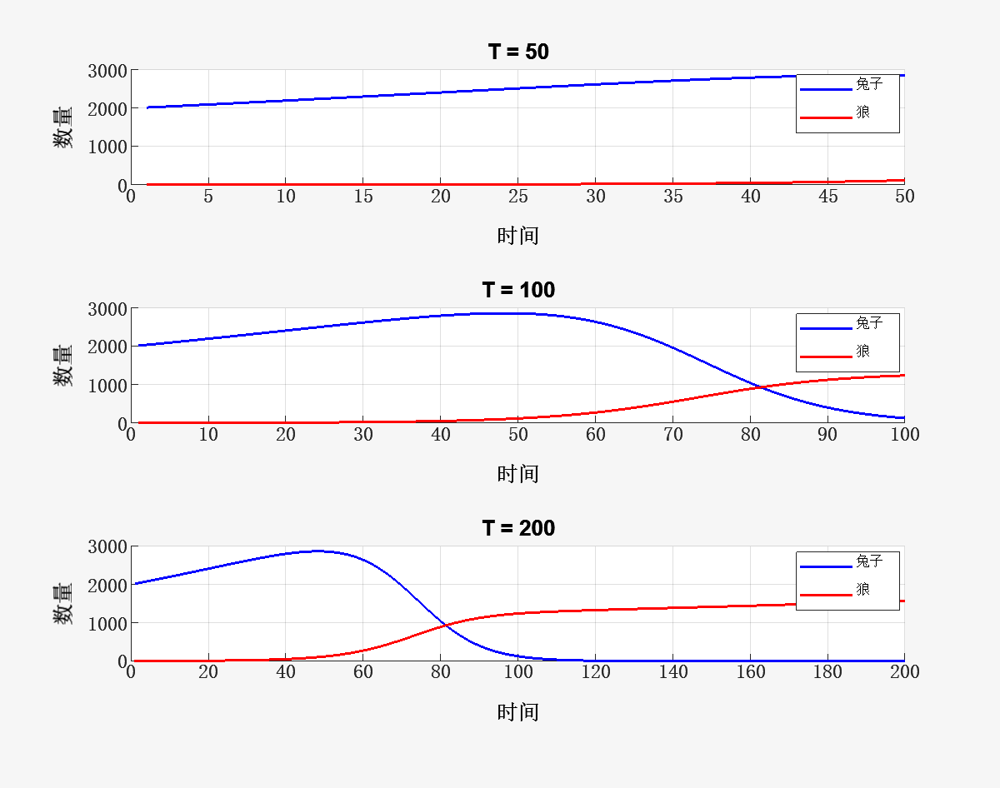

# 数值方法 Homework 5

## Problem 1

使用以下代码实现PageRank
```matlab
% 初始化矩阵
M = [  0    0   1/6  1/3  1/4  1/4;
     1/3    0   1/6  1/3    0  1/6;
     1/3  1/6     0  1/6  1/3    0;
     1/6  1/6   1/3    0  1/6  1/6;
       0  1/3   1/3    0    0  1/3;
     1/6  1/6   1/4  1/4  1/6    0];
MT = M';

n = size(M, 1);

% 初始化PageRank向量
PageRank = ones(n, 1) / n;
old_PageRank = zeros(n, 1); 

tolerance = 1e-8;

% 循环直至收敛，由于没人能给自己投票，认为不会停留在自身网页
while norm(PageRank - old_PageRank, 1) > tolerance
    old_PageRank = PageRank;
    PageRank = MT * PageRank;
end

% 打印结果
disp('PageRank 结果:');
disp(PageRank');

[~, index] = max(PageRank);
candidates = ['A', 'B', 'C', 'D', 'E', 'F'];
fprintf('最优秀班干部是: %s\n', candidates(index));
```
最终结果为
```
'PageRank 结果:'

    0.1686    0.1421    0.2018    0.1746    0.1634    0.1494

最优秀班干部是: C
```

## Problem 2

使用以下代码模拟人口增长
```matlab
% Initialize params
r = 0.03;
K = 100;
N = 500;

% Initialize population vectors
x = zeros(1, N);
y = zeros(1, N);
x(1) = 0.1;
y(1) = 0.1;

% 马尔萨斯模型
for n = 1:N-1
    x(n+1) = x(n) + r * x(n);
end

% 逻辑斯蒂克模型
for n = 1:N-1
    y(n+1) = y(n) + r * (1 - y(n)/K) * y(n);
end
```
使用以下代码画图
```matlab
figure;
subplot(2,1,1);
plot(1:N, x, 'b');
title('马尔萨斯模型');
xlabel('时间');
ylabel('人口');
grid on;

subplot(2,1,2);
plot(1:N, y, 'r');
title('逻辑斯蒂克模型');
xlabel('时间');
ylabel('人口');
grid on;
```
结果如下图



在马尔萨斯模型中，人口数量呈指数增长，没有上限；在逻辑斯蒂克模型中，人口数量最终趋于承载能力$K$。

## Problem 3

将模型递推公式重写为
$$
\begin{aligned}
p_t r + (-p_tq_t)f = p_{t+1}-p_t \\
q_t w + (p_tq_t)g = q_{t+1}-q_t
\end{aligned}
$$

用以下代码进行参数估计

```matlab
% Initialize states
x_data = [         2000           3; 
                 2019.4       3.186; 
          2038.95061916 3.385386252];
p = x_data(:, 1);
q = x_data(:, 2);

% Build linear equations 

% solve A1[r;f]' = b1
A1 = [p(1), -p(1) * q(1);
      p(2), -p(2) * q(2)];
b1 = [p(2) - p(1); p(3) - p(2)];
params = linsolve(A1, b1);
r = params(1);
f = params(2);

% solve A2[w;g]' = b2
A2 = [q(1), p(1) * q(1);
      q(2), p(2) * q(2)];
b2 = [q(2) - q(1); q(3) - q(2)];
params = linsolve(A2, b2);
w = params(1);
g = params(2);
```
得到结果为
```
[r, f, w, g]: [0.01000000, 0.00010000, 0.00200000, 0.00003000]
```
用以下代码绘图
```matlab
Ts = [50, 100, 200];
figure;
for j = 1:length(Ts)
    subplot(length(Ts), 1, j);
    
    t = Ts(j);
    p0 = 2000;
    q0 = 3;
    x = zeros(2, t);
    for i = 1:t
        x(1, i) = (1 + r) * p0 - f * p0 * q0;
        x(2, i) = (1 + w) * q0 + g * p0 * q0;
        p0 = x(1, i);
        q0 = x(2, i);
    end
    plot(1:t, x(1, :), '-b', 'LineWidth', 2);
    hold on;
    plot(1:t, x(2, :), '-r', 'LineWidth', 2);
    xlabel('时间');
    ylabel('数量');
    title(['T = ', num2str(Ts(j))]);
    legend('兔子', '狼');
    grid on;
end
```
结果如下



初始时(T < 50)兔子和狼的数目都在增加，但紧接着兔子的数目开始下降(50 < T < 100)并最终趋于0(100 < T < 200)，但狼的数量始终在上升