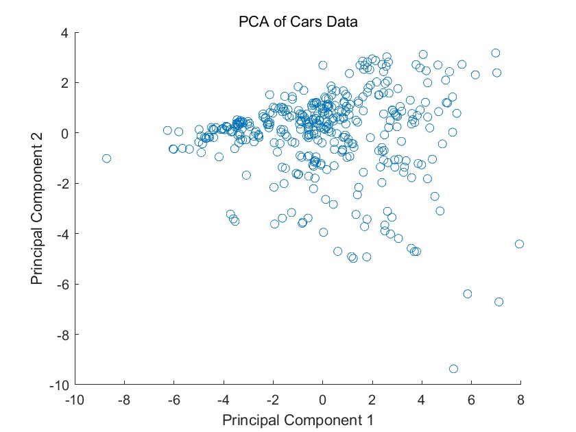

# 数值方法 Homework6

## Problem 1

读入数据并标准化
```matlab
cars_data = readtable('cars.csv', 'Range', 'B2');
cars_raw = table2array(cars_data);
cars_mean = mean(cars_raw);
cars_std = std(cars_raw);

cars = (cars_raw - cars_mean) ./ (cars_std + 1e-10);
```
进行2维的SVD分解
```matlab
cov_matrix = cov(cars);
[V, D] = sort_eig(cov_matrix);

k = 2;
V_k = V(:, 1:k);
projected_data = cars * V_k;

function [VV,DD] = sort_eig(A)
    [V,D] = eig(A);
    d  = diag(D);
    [dd ,ii] = sort(d, 'descend');
    DD = diag(dd);
    VV = V(:, ii);
end  
```
绘制投影图像
```matlab
disp(projected_data);
scatter(projected_data(:,1), projected_data(:,2));
xlabel('Principal Component 1');
ylabel('Principal Component 2');
title('PCA of Cars Data');
```
结果如下



## Problem 2

在层次分析法中，目标层为选择合适的公司，准则层为专业对口、工作稳定和薪水，方案层为甲乙两家公司

假设问卷中自(A)~(G)的相对权重为$\dfrac{1}{5},\dfrac{1}{4},\dfrac{1}{2},1,2,4,5$

首先建立指标判断矩阵并进行一致性检验
```matlab
% 专业对口、工作稳定、薪水
A = [ 1   4   2;
    1/4   1 1/5;
    1/2   5   1];

consistency_check(A);

function consistency_check(A)
    [~, n] = size(A);
    [~, d] = eig(A);
    % 求最大特征值
    max_v = max(max(d));
    % 计算一致性指标CI
    CI = (max_v - n) / (n - 1);
    RI = [0 0 0.52 0.89 1.12 1.26 1.36 1.41 1.46 1.49 1.52 1.54 1.56 1.58 1.59];
    % 计算一致性比例CR
    CR = CI / RI(n);
    disp("一致性比例为");
    disp(CR);
    if CR < 0.10
        disp("通过一致性检验");
    else
        disp("不通过一致性检验");
    end
end
```

接着建立方案层对于各个指标的比较矩阵并求出最大特征值对应的特征向量
```matlab
eigA = get_max_eig(A);

% 专业对口
B1 = [1 1/4;
      4   1];
eig1 = get_max_eig(B1);
% 工作稳定
B2 = [ 1  2;
     1/2  1];
eig2 = get_max_eig(B2);
% 薪水
B3 = [1 1/2;
      2   1];
eig3 = get_max_eig(B3);

function max_eig = get_max_eig(A)
    [V, D] = eig(A);
    % 找出最大特征值和对应的特征向量
    max_eigenvalue = max(diag(D));
    [~, max_eigenvalue_index] = find(diag(D) == max_eigenvalue, 1);
    max_eig = V(:, max_eigenvalue_index);
end
```

最后计算加权得到的结果并进行比较
```matlab
eigB = [eig1 eig2 eig3];
result = eigB * eigA;

fprintf('公司甲得分: %.4f\n', result(1));
fprintf('公司乙得分: %.4f\n', result(2));

if result(1) > result(2)
    fprintf('建议选择公司甲\n');
else
    fprintf('建议选择公司乙\n');
end
```
输出为
```
公司甲得分: 0.5814
公司乙得分: 1.3575
建议选择公司乙
```