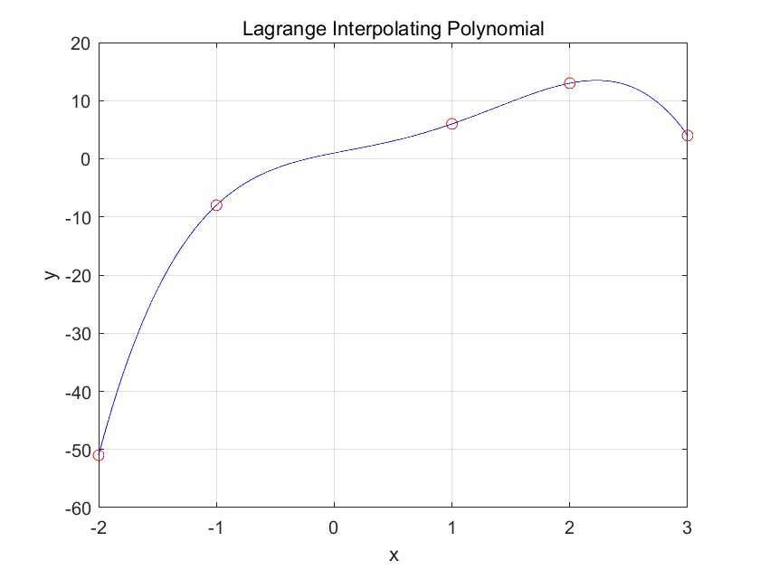
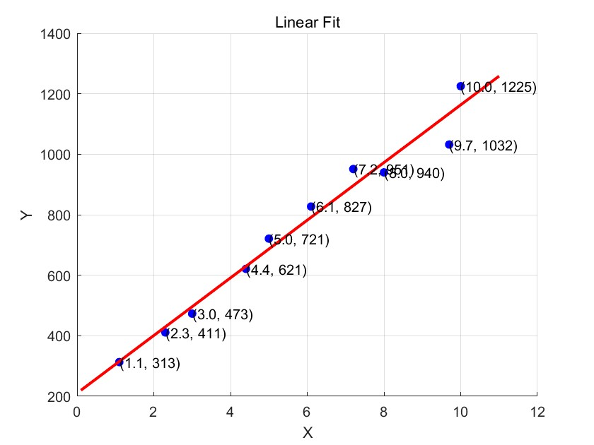
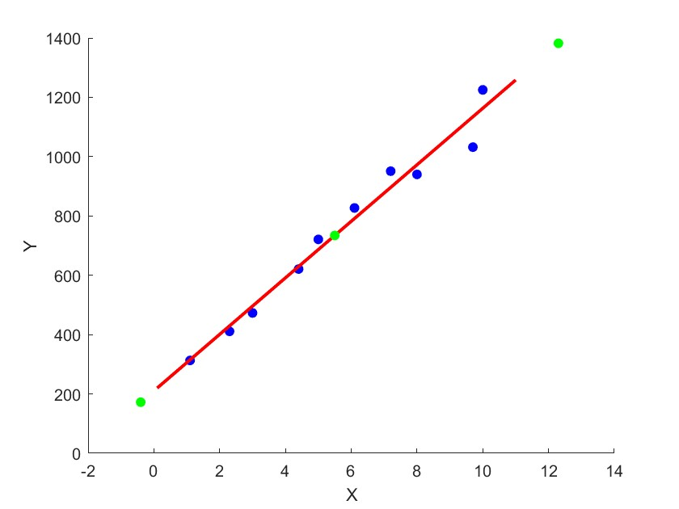

# 数值方法 Homework7

## Problem 1

(1) $f_1(x) = \dfrac{(x+1)(x-2)(x-3)(x-1)}{60}$

$f_2(x) = \dfrac{(x+2)(x-2)(x-3)(x-1)}{-24}$

$f_3(x) = \dfrac{(x+2)(x+1)(x-3)(x-1)}{-12}$

$f_4(x) = \dfrac{(x+2)(x+1)(x-2)(x-1)}{40}$

$f_5(x) = \dfrac{(x+2)(x+1)(x-2)(x-3)}{12}$

(2) 四次插值多项式为$\sum_{i=1}^{5}y_if_i(x)$，在基$\boldsymbol{f}$下的坐标即为$(-51, -8, 13, 4, 6)$

绘图的代码如下
```matlab
x = [-2, -1, 2, 3, 1];
y = [-51, -8, 13, 4, 6];

n = length(x);

syms t;
f = 0;
for i = 1:n
    Li = 1;
    for j = 1:n
        if j ~= i
            Li = Li * (t - x(j)) / (x(i) - x(j));
        end
    end
    f = f + y(i) * Li;
end


f_handle = matlabFunction(f);
x_interp = linspace(min(x), max(x), 1000);
y_interp = f_handle(x_interp);

figure;
plot(x_interp, y_interp, 'b-', x, y, 'ro');
title('Lagrange Interpolating Polynomial');
xlabel('x');
ylabel('y');
grid on;
```
绘图结果为




## Problem 2

使用以下代码进行拟合并画图
```matlab
x_data = [1.1, 2.3, 3, 4.4, 5, 6.1, 7.2, 8, 9.7, 10];
y_data = [313, 411, 473, 621, 721, 827, 951, 940, 1032, 1225];

coefficients = polyfit(x_data, y_data, 1);
a = coefficients(1);
b = coefficients(2);

disp(a);
disp(b);

scatter(x_data, y_data, 'blue', 'filled');
hold on;

x_fit = linspace(min(x_data)-1, max(x_data)+1, 100);
y_fit = a * x_fit + b;
plot(x_fit, y_fit, 'red', 'LineWidth', 2);

for i = 1:length(x_data)
    text(x_data(i), y_data(i), sprintf('(%.1f, %d)', x_data(i), y_data(i)));
end

title('Linear Fit');
xlabel('X');
ylabel('Y');
grid on;
```
得到拟合结果为$f(x)=   95.2733x+  210.2477$

绘图结果为




## Problem 3

用以下代码训练线性回归器并进行预测
```matlab
x_data = [1.1, 2.3, 3, 4.4, 5, 6.1, 7.2, 8, 9.7, 10];
y_data = [313, 411, 473, 621, 721, 827, 951, 940, 1032, 1225];

weights = rand();
bias = rand();

learning_rate = 0.001;
iterations = 5000;

for i = 1:iterations
    Z = weights * x_data + bias; 
    A = Z; 

    loss = 0.5 * sum((A - y_data).^2);

    dZ = A - y_data;
    dweights = sum(dZ .* x_data); 
    dbias = sum(dZ); 

    weights = weights - learning_rate * dweights;
    bias = bias - learning_rate * dbias;

    if mod(i, 1000) == 0
        fprintf('Iteration %d, Loss: %f\n', i, loss);
    end
end

disp('Trained weights:');
disp(weights);
disp('Trained bias:');
disp(bias);

scatter(x_data, y_data, 'blue', 'filled');
hold on;

x_fit = linspace(min(x_data)-1, max(x_data)+1, 100);
y_fit = weights * x_fit + bias;
plot(x_fit, y_fit, 'red', 'LineWidth', 2);
xlabel('X');
ylabel('Y');
hold on;

X_new = [-0.4, 5.5, 12.3]';
Z_new = weights * X_new + bias; 
A_new = Z_new;
disp('Predicted outputs for new inputs:');
disp(A_new);

scatter(X_new, Z_new, 'green', 'filled');
hold on;
```

训练结果为
```
Trained weights:
   95.2743

Trained bias:
  210.2403
```
对于$ -0.4, 5.5, 12.3$三点的预测值为
```
   1.0e+03 *

    0.1721
    0.7342
    1.3821
```
绘图结果为


