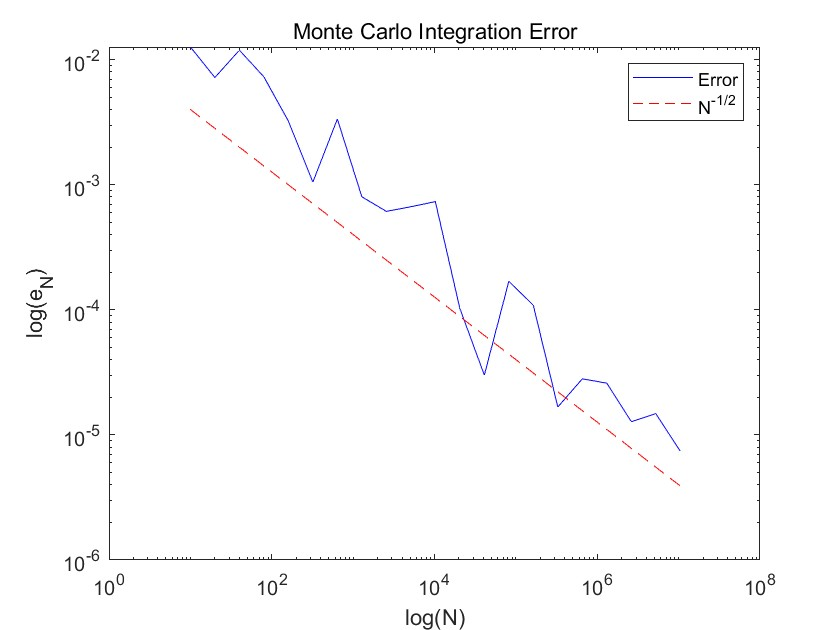

# 数值方法 Homework 9

使用以下代码对不同的N进行数值积分估算和误差估算，对于每个N进行100次实验并对误差取均值
```matlab
N_values = 10 * 2.^(0:20);
num_experiments = 100;
I_exact = 1;

error_values = zeros(length(N_values), 1);

for i = 1:length(N_values)
    N = N_values(i);
    estimated_integral = 0;
    for j = 1:num_experiments
        x = rand(N, 1) * (pi/2);
        estimated_integral = estimated_integral + sum(sin(x));
    end
    estimated_integral = estimated_integral * (pi/2) / N / num_experiments;
    error_values(i) = abs(estimated_integral - I_exact);
end
```

使用以下代码进行对数坐标轴上的画图
```matlab
loglog(N_values, error_values, 'b');
hold on;
loglog(N_values, (N_values.^(-1/2)) * max(error_values), 'r--');
xlabel('log(N)');
ylabel('log(e_N)');
title('Monte Carlo Integration Error');
legend('Error', 'N^{-1/2}');
```

绘图结果如下，$\log N-\log e_N$近似服从斜率为-1/2的线性关系
