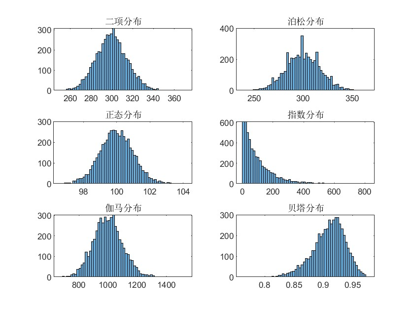

# 数值方法 Homework 10

用以下代码设置参数并采样
```matlab
N = 5000;
n = 1000;
p = 0.3;
lambda = n * p;
mu = 100;
sigma = 1;
a = 100;
b = 10;

data_binomial = binornd(n, p, N, 1);
data_poisson = poissrnd(lambda, N, 1);
data_normal = normrnd(mu, sigma, N, 1);
data_exponential = exprnd(mu, N, 1);
data_gamma = gamrnd(a, b, N, 1);
data_beta = betarnd(a, b, N, 1);
```

用以下代码绘制直方图
```matlab
figure;

subplot(3, 2, 1);
histogram(data_binomial, 60);
title('二项分布');

subplot(3, 2, 2);
histogram(data_poisson, 60);
title('泊松分布');

subplot(3, 2, 3);
histogram(data_normal, 60);
title('正态分布');

subplot(3, 2, 4);
histogram(data_exponential, 60);
title('指数分布');

subplot(3, 2, 5);
histogram(data_gamma, 60);
title('伽马分布');

subplot(3, 2, 6);
histogram(data_beta, 60);
title('贝塔分布');
```

结果如下

