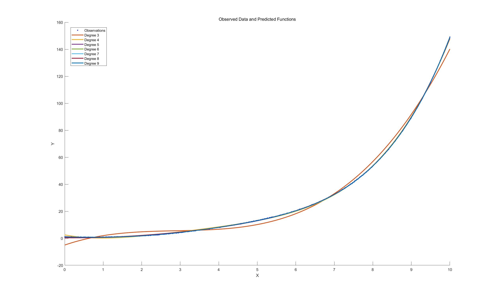

# 数值方法 Homework 11

以下代码用于生成并绘制带噪声的数据，设定优化选项
```matlab
X = linspace(0, 10, 1000)';
Y = exp(0.5*X) - sin(X) + 0.1*randn(size(X));
options = optimoptions('lsqnonlin', 'Algorithm', 'trust-region-reflective');

figure;
hold on;
plot(X, Y, 'b.', 'DisplayName', 'Observations');
```
以下代码定义多项式求值函数和目标函数
```matlab
func_poly_pred = @(theta) (polyval(fliplr(theta), X));
fun_target = @(theta) Y - func_poly_pred(theta);
```
以下代码分别对$n=3,4,5,6,7,8,9$进行多项式拟合并绘图
```matlab
degrees = 3:9;
for i = 1:length(degrees)
    degree = degrees(i);
    theta0 = ones(1, degree + 1); % 初始参数估计
    % 使用 lsqnonlin 求解非线性最小二乘问题
    [theta_opt, resnorm, ~, ~, ~] = lsqnonlin(fun_target, theta0, [], [], options);
    
    % 显示优化结果
    fprintf('Degree %d - Optimized parameters: ', degree);
    disp(theta_opt);
    fprintf('Residual norm: %f\n', resnorm);
    
    % 绘制预测结果
    Y_predicted = func_poly_pred(theta_opt);
    plot(X, Y_predicted, 'LineWidth', 2, 'DisplayName', ['Degree ' num2str(degree)]);
end
hold off;
legend('Location', 'best');
xlabel('X');
ylabel('Y');
title('Observed Data and Predicted Functions');
```
输出的预测系数和残差范数如下
```
Degree 3 - Optimized parameters:    -5.0298    9.8047   -3.1771    0.3649
Residual norm: 6660.006933

Degree 4 - Optimized parameters:     2.5394   -5.4022    3.6740   -0.7012    0.0533
Residual norm: 165.527424

Degree 5 - Optimized parameters:     1.2834   -1.6076    1.0125    0.0091   -0.0266    0.0032
Residual norm: 17.745938

Degree 6 - Optimized parameters:     1.0442   -0.5926   -0.0056    0.4168   -0.1031    0.0099   -0.0002
Residual norm: 13.153694

Degree 7 - Optimized parameters:     
0.8968    0.2440   -1.1397    1.0480   -0.2768    0.0350   -0.0020    0.0001
Residual norm: 11.622519

Degree 8 - Optimized parameters:     
0.9934   -0.4638    0.1057    0.1324    0.0669   -0.0366    0.0063   -0.0005    0.0000
Residual norm: 11.032898

Degree 9 - Optimized parameters:     
0.9830   -0.3635   -0.1165    0.3404   -0.0348   -0.0080    0.0015    0.0000   -0.0000    0.0000
Residual norm: 11.026162
```
可以看出7,8,9次多项式效果较好

得到的图片如下


