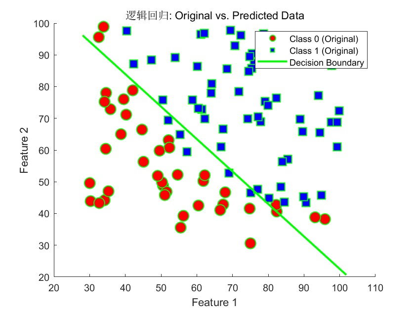

# 数值方法 Homework 15

使用的数据为`data.txt`，数据共3列，分别为两次考试的分数和学生通过(1)/不通过(0)的标签

使用以下代码读入数据并初始化逻辑回归参数、定义逻辑回归过程中的函数
```matlab
data = load('data.txt');
X = data(:,1:2);
y = data(:,3);

% 添加偏置项x0 = 1
X = [ones(size(X, 1), 1) X];
% 初始化逻辑回归的参数
theta_initial = zeros(size(X, 2), 1);
% 定义sigmoid函数
sigmoid = @(z) 1./(1 + exp(-z));
% 定义代价函数（负对数似然函数）
costFunction = @(theta) -(1/size(X,1)) * ( ...
    y' * log(sigmoid(X*theta)) + (1-y)' * log(1 - sigmoid(X*theta)));
% 定义梯度函数（代价函数关于参数的导数）
gradientFunction = @(theta) ( ...
    1/size(X,1)) * X' * (sigmoid(X*theta) - y);
% 将代价函数和梯度函数转换为适合fminunc使用的单个函数
objectiveFunction = @(theta) costFunctionAndGradient( ...
    theta, X, y, costFunction, gradientFunction);

% 定义代价函数和梯度返回函数
function [J, grad] = costFunctionAndGradient( ...
    theta, X, y, costFunction, gradientFunction)
    J = costFunction(theta);
    grad = gradientFunction(theta);
end
```
使用以下代码进行优化并打印参数
```matlab
% 使用fminunc来求解逻辑回归的参数
options = optimoptions('fminunc', ...
    'Algorithm', 'quasi-newton', ...
    'SpecifyObjectiveGradient',true, ...
    'Display', 'iter');
[theta_opt, fval, exitflag, output] = fminunc( ...
    objectiveFunction, theta_initial, options);

% 显示优化后的参数
disp('优化后的参数 theta：');
disp(theta_opt);
```
得到结果为
```
优化后的参数 theta：
  -25.1613
    0.2062
    0.2015
```

使用以下代码绘制数据点和决策边界
```matlab
% 绘制原始数据
figure; % 创建一个新的图形窗口
hold on; % 保持图形，以便在同一个图上绘制多个数据集

% 绘制原始数据点
i0 = y==0;
sh = scatter(X(i0,2), X(i0,3), 120, y(i0), ...
    'filled', "o", 'MarkerFaceColor', 'r', ...
    'MarkerEdgeColor', 'g', 'LineWidth', 1);
i1 = y==1;
sh = scatter(X(i1,2), X(i1,3), 120, y(i1), ...
    'filled', "square", 'MarkerFaceColor', 'b', ...
    'MarkerEdgeColor', 'g', 'LineWidth', 1);

% 绘制决策边界
decision_boundary_x = [min(X(:,2))-2, max(X(:,2))+2];
decision_boundary_y = -(theta_opt(1) + ...
    theta_opt(2)*decision_boundary_x) / theta_opt(3);
plot(decision_boundary_x, decision_boundary_y, 'g', 'LineWidth', 2);

% 设置图例和坐标轴标签
legend({'Class 0 (Original)', 'Class 1 (Original)', 'Decision Boundary'});
xlabel('Feature 1');
ylabel('Feature 2');
title('逻辑回归: Original vs. Predicted Data');

hold off; % 释放图形锁定
```
得到结果

