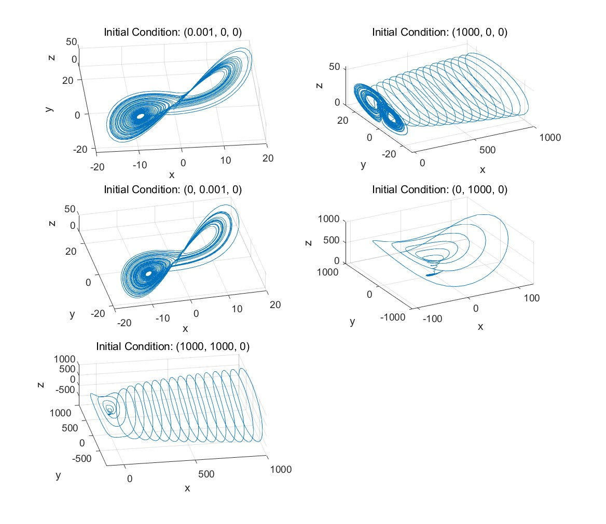
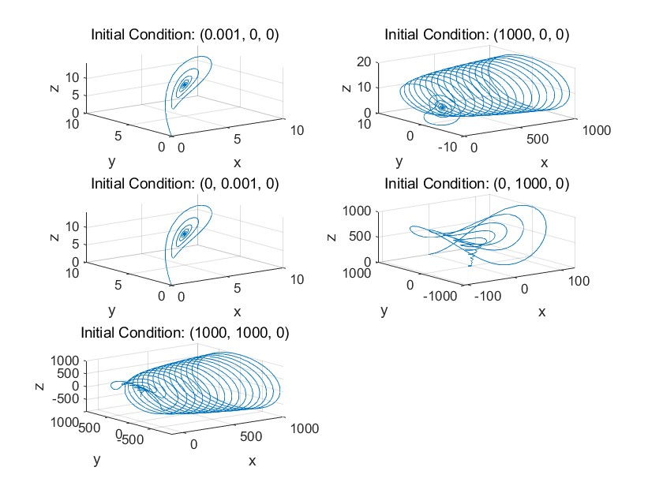

# 数值方法 Homework 16

选择题目2

(1)

用以下代码定义参数和ODE函数
```matlab
% 定义参数
sigma = 10;
rho = 28;
beta = 8/3;

% 定义ODE函数
lorenz = @(t, xyz) [sigma * (xyz(2) - xyz(1)); ...
                    rho * xyz(1) - xyz(2) - xyz(1) * xyz(3); ...
                    xyz(1) * xyz(2) - beta * xyz(3)];
```

设置初始条件
```matlab
% 设置初始条件
initial_conditions = [1e-3 0 0; ...
                      1e3 0 0; ...
                      0 1e-3 0; ...
                      0 1e3 0; ...
                      1e3 1e3 0];

% 设置时间范围
tspan = [0 50];
```

绘制结果
```matlab
figure;
for i = 1:size(initial_conditions, 1)
    [t, xyz] = ode45(lorenz, tspan, initial_conditions(i,:));
    subplot(3,2,i);
    plot3(xyz(:,1), xyz(:,2), xyz(:,3));
    title(['Initial Condition: (', ...
        num2str(initial_conditions(i,1)), ', ', ...
        num2str(initial_conditions(i,2)), ', ', ...
        num2str(initial_conditions(i,3)), ')']);
    xlabel('x');
    ylabel('y');
    zlabel('z');
    grid on;
end
```

结果如下



曲线最终都在原点附近（约40^3的范围）做具有一定周期性的运动

初始x较大时，开始的运动在xz平面上的投影会有一定螺旋形规律；初始y较大，xz为0时，开始的运动在xy平面上的投影会有一定螺旋形规律

(2) 更换参数，结果如下



前三条曲线收敛到(5,5,9)附近，后两条曲线收敛到(-5,-5,9)附近